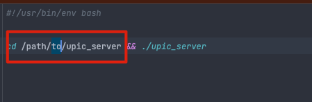
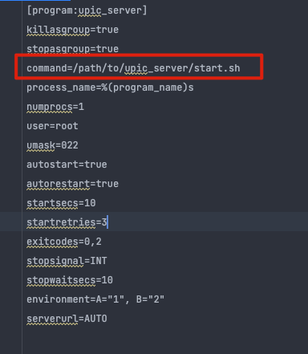

# upic_server
A uPic server implement by go 

#### 自定义uPic图床服务端

简介: [upic](https://blog.svend.cc/upic/)

自定义配置: [自定义图床配置](https://blog.svend.cc/upic/tutorials/custom/)

#### 启动方式

- 编译

```bash
    cd /path/to/upic_server && go build 
```

- 直接启动

```bash
nohup ./upic_server &
```

- supervisor启动
  
  - 修改`start.sh`文件, 指向`upic_server`的绝对路径
  
  

  - 修改`supervisor`配置文件, 指向`start.sh`的绝对路径
  
  

  - 复制`supervisor`配置文件至supervisor安装目录的`conf.d`路径

  - 执行 `supervisorctl update && supervisorctl restart upic_server` 即可

#### 注意 server 读取和写入图片时使用的相对路径, 请注意部署过程中的路径问题
